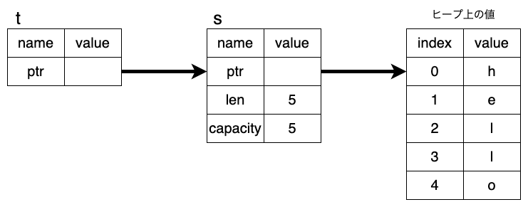
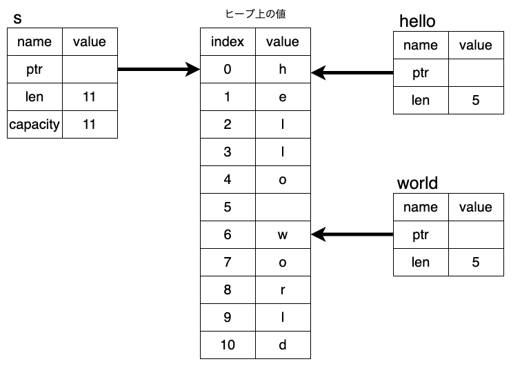

+++
title = "Rustの所有権を理解する"
date = "2022-02-06T01:35:35+09:00"
draft = false
+++

# Rustの所有権を理解する

Rustには所有権という概念があります。この記事は The Rust Programming Language の以下の記事を参考にしています。

- [4.所有権を理解する](https://doc.rust-jp.rs/book-ja/ch04-00-understanding-ownership.html)
- [4.1.所有権とは？](https://doc.rust-jp.rs/book-ja/ch04-01-what-is-ownership.html)
- [4.2.参照と借用](https://doc.rust-jp.rs/book-ja/ch04-02-references-and-borrowing.html)
- [4.3.スライス型](https://doc.rust-jp.rs/book-ja/ch04-03-slices.html)

プログラム中の変数などの値はプログラムが動いている間どこに記録されているのでしょうか？それはレジスタやメモリの中です。レジスタは容量が小さいため、メモリの使用方法、どうメモリを管理するかが大切になってきます。

プログラミング言語のメモリの管理方法は次の2つが主流です。

- GC(ガベージコレクタ)を使用する: Java, Go, Python, JavaScript
- プログラマが明示的にmalloc/freeのような仕組みでメモリを管理する: C, C++

GCは、使われていないメモリを定期的に検索し削除する仕組みのことです。自動で削除してくれる点は良いのですが、パフォーマンスの観点からGCが問題になる場合もあります。 [Why Discord is switching from Go to Rust](https://blog.discord.com/why-discord-is-switching-from-go-to-rust-a190bbca2b1f) では、Goで書かれていたdiscordというサービスの基盤の一部はGCによるパフォーマンス低下を改善するためにRustに書き直されたという話があります。

Rustは上の2つとは異なる、第3の選択肢として「所有権」という仕組みを導入しました。

まずは、所有権を理解するために前提知識を学んでいきましょう。

# 前提知識

## スタックとヒープ

スタックとヒープは、アルゴリズムとデータ構造分野と、低レイヤ分野で同じ言葉が出てきますが、それらの意味は異なります。

### データ構造のスタック

これは、先頭への要素の追加(push)と、先頭からの要素の取り出し(pop)の2つの操作ができるデータ構造のことです。

### 低レイヤ分野のスタック(スタック領域)

これはメモリ領域の一部です。データ構造のスタックと似た構造をしていて、push/popを行うことができます。ただそれに加えて、スタックに置かれるデータは全て固定サイズである必要があります。これらの特性のおかげでスタックは高速に動作し、動作するプログラムのパフォーマンスも高いものになります。

### データ構造のヒープ

木構造を使った最大値もしくは最小値を高速に検索できるデータ構造のことです。これは今回本題ではないので [wikipedia - ヒープ](https://ja.wikipedia.org/wiki/%E3%83%92%E3%83%BC%E3%83%97) を参考にしてください。

### 低レイヤ分野のヒープ(ヒープ領域)

これもメモリ領域の一部です。ただデータ構造のヒープとは関係ありません。

ヒープにはコンパイル時にサイズが分からなかったり、プログラム実行中にサイズが変化するデータを格納することができます。仕組みとしては、ヘッダに領域確保/解放済みなどの情報を持たせたメモリ領域の一部を一つのノードとする双方向Linked Listで管理しています。

ヒープへのデータアクセスはスタックよりも低速です。

# 所有権とは

これまでの前提知識パートでスタックとヒープについて理解できたと思います。所有権について説明していきます。

所有権のルールは以下のようになります。([TRPL - 所有権規則](https://doc.rust-jp.rs/book-ja/ch04-01-what-is-ownership.html#%E6%89%80%E6%9C%89%E6%A8%A9%E8%A6%8F%E5%89%87) よりほぼ引用)

- Rustの各値は、**所有者**と呼ばれる変数と対応している
- いかなる時も所有者は**一つだけ**しかない。
- 所有者がスコープを外れたら、値は破棄される。

## 変数スコープ

スコープは、ある値が有効であるプログラムの範囲内です。

**演習**

- 次のプログラムはコンパイルできますか？実行する前に予想してみましょう。 [問題 1](https://play.rust-lang.org/?version=stable&mode=debug&edition=2021&gist=51d0ac822c8fda4c0908f22c1b4b4521)
	- [解答](https://play.rust-lang.org/?version=stable&mode=debug&edition=2021&gist=80785ee90c06598cc2e416f977f550fe)
- 次のプログラムはコンパイルできますか？実行する前に予想してみましょう。 [問題 2](https://play.rust-lang.org/?version=stable&mode=debug&edition=2021&gist=2ffa2225318b581571d696c27469672e)
	- [解答](https://play.rust-lang.org/?version=stable&mode=debug&edition=2021&gist=976c0ca515d853e813a53936c13efe71)

## String型

Rustの型は [pub.docs - Rustを学ぼう](../index.md) で学んだ基本的なデータ型以外にも複雑なものがあります。例としてString型を通して、所有権について学びましょう。

文字列リテラルの他に、String型があります。どちらも文字列を扱うことができます。

```rust
let s1 = "hello"; // 文字列リテラル
let s2 = String::from("hello"); // String型
```

違いとして、文字列リテラルは不変、String型は可変ということが挙げられます。これは変数がメモリをどう使用しているかということに関係しています。

文字列リテラルは不変なのでコンパイル時にサイズがわかるため、実行バイナリの中にハードコードされています。

それに対し、String型は可変なので、ヒープに領域が確保されます。

**演習**

- 次のプログラムはコンパイル可能でしょうか？実行する前に予想してみましょう。 [問題 1](https://play.rust-lang.org/?version=stable&mode=debug&edition=2021&gist=8dda15737566d2968b4b35f65d02b647)
	- [解答](https://play.rust-lang.org/?version=stable&mode=debug&edition=2021&gist=67d5ce811b64804ee8d6dfcd4cbd2db5)
- 変数スコープでの演習と異なるのは、ヒープを使っている点です。ヒープに確保された値はどうなったのでしょうか？
	- [参考: TRPL - メモリと確保](https://doc.rust-jp.rs/book-ja/ch04-01-what-is-ownership.html#%E3%83%A1%E3%83%A2%E3%83%AA%E3%81%A8%E7%A2%BA%E4%BF%9D)
	- [参考: Rust by Example - drop](https://doc.rust-jp.rs/rust-by-example-ja/trait/drop.html)
	- [参考: Zenn - [Rust] Drop/dropあれこれ](https://zenn.dev/eduidl/articles/b708cd28c9d07a)
	- [解答](https://play.rust-lang.org/?version=stable&mode=debug&edition=2021&gist=461d733b07aa812af129ff3b1f666afc)

## ムーブ

**演習**
- 以下のコード問題1,2をスタックやヒープの観点から説明してみましょう。

問題1

```rust
let s = 10;
let t = s;
```

問題2

```rust
let s = String::from("hello");
let t = s;
```

それでは、演習の解答を解説します。

問題1は、スタックに `s`, `t` の値が積まれている様子が説明できたらOKです。 `10` という値はコンパイル時に判明しているのでスタックを使うことが予想できます。最初に変数 `s` の値をスタックに積み、変数 `t` は `s` の値をコピーしてスタックに積む。という感じになります。

問題2は、ヒープを使っています。Rustでは、ヒープに確保した値はデフォルトではコピーしません。以下のように、元の変数 `s` を無効化し、ヒープに確保したデータはそのままに、変数 `t` の実体をそのデータに変更する、という挙動になります。このあたりがなぜそうなっているのかは [TRPL ムーブ](https://doc.rust-jp.rs/book-ja/ch04-01-what-is-ownership.html#%E5%A4%89%E6%95%B0%E3%81%A8%E3%83%87%E3%83%BC%E3%82%BF%E3%81%AE%E7%9B%B8%E4%BA%92%E4%BD%9C%E7%94%A8%E6%B3%95-%E3%83%A0%E3%83%BC%E3%83%96) を読むと良いでしょう。


このように、 `s` は `t` にムーブされ、有効ではなくなります。

**演習**

- 次のプログラムはコンパイル可能でしょうか？実行する前に予想してみましょう。 [問題 1](https://play.rust-lang.org/?version=stable&mode=debug&edition=2021&gist=7c9c3ad0b9eef11897999da01b8f076a)
	- [解答](https://play.rust-lang.org/?version=stable&mode=debug&edition=2021&gist=e26315752026bc32ed7a894968ca94fd)
- 次のプログラムはコンパイル可能でしょうか？実行する前に予想してみましょう。 [問題 2](https://play.rust-lang.org/?version=stable&mode=debug&edition=2021&gist=af7b30aaed2c79e0abbdcfcec713122b)
	- [解答](https://play.rust-lang.org/?version=stable&mode=debug&edition=2021&gist=f45ef3e91f85915a35a091e447bd9d65)

## clone

上の例で、ムーブではなく、変数のコピーが必要(deep copyと呼ばれます)な時のために、 [`.clone()`](https://doc.rust-lang.org/std/clone/trait.Clone.html) というメソッドがあります。

**演習**

- 次のコードをコンパイルが通るように書き換えよ [問題](https://play.rust-lang.org/?version=stable&mode=debug&edition=2021&gist=9e12d6d9c647e25eda9118ac23726968)
	- [解答](https://play.rust-lang.org/?version=stable&mode=debug&edition=2021&gist=871ceef539f6a65ee5b7189c351ef2f2)

## 関数

関数に値を渡すときも、値はムーブやコピーされます。

**演習**

- 次のコードの所有権の動きを説明してみよう [問題](https://play.rust-lang.org/?version=stable&mode=debug&edition=2021&gist=3e6e6aac0105e12c8690fbe6e9121237)
	- 変数 `A` が変数 `B` にムーブされる、というように説明すればOK
	- [解答](https://play.rust-lang.org/?version=stable&mode=debug&edition=2021&gist=2bdf860d3073f9f4068b3a9f9a8e7bf4)

# 参照

関数に値を渡して、その値をその後も使いたい場合はどうすれば良いでしょうか？以下のような場合を考えましょう。

```rust
let s = String::from("I don't know this string length");
let length = get_length(s); // 長さが知りたいだけなのにムーブされてしまう

// sが使えない！
```

このような場合、**参照**を使うと良いです。


(補足: 単に長さを知るだけなら、`s.len()`が使えます。)

参照は、 `&` を使って表します。以下のコードと、対応するメモリ上での様子を見ていきましょう。

```rust
let s = String::from("hello");
let t = get_length(&s);

// sが使える
```



参照を代入したり関数の引数に参照を取ったりしてもムーブは起きません。

**演習**

- 次のコードを参照を用いてコンパイルが通るように修正しましょう。 [問題](https://play.rust-lang.org/?version=stable&mode=debug&edition=2021&gist=b85b9f66619e76f58bc0721119d05705)
	- [参考 TRPL - 参照と借用](https://doc.rust-jp.rs/book-ja/ch04-02-references-and-borrowing.html)
	- [解答](https://play.rust-lang.org/?version=stable&mode=debug&edition=2021&gist=b6709f067b559d13ec6e6a45e4233989)

## 可変な参照

関数で参照を受け取り、その値に何か操作を行いたい場合に可変な参照が使われます。以下の状況を考えてみましょう。

```rust
// このコードは動かない
fn main() {
	let mut s = String::from("hello");
	append_world(&s);
	println!("{}", s);
}

fn append_world(s: &String) {
	s.push_str(", world");
}
```

[Rust Playgroundのリンク](https://play.rust-lang.org/?version=stable&mode=debug&edition=2021&gist=a607d047b70a7b4e48108bf16544d0b7)

上のコードはコンパイルが通りません。そこで、可変な参照を使ってみましょう。

```rust
fn main() {
	let mut s = String::from("hello");
	append_world(&mut s);
	println!("{}", s);
}

fn append_world(s: &mut String) {
	s.push_str(", world");
}
```

[Rust Playgroundのリンク](https://play.rust-lang.org/?version=stable&mode=debug&edition=2021&gist=64595e3af241d3cd69da742c3dbfbd61)

`&mut s` のように `mut` キーワードをつけることで可変な参照を得ています。可変な参照は、参照先のヒープに格納されたデータにアクセスすることができます。

ただし、可変な参照はデータ競合などを防ぐために以下の規則があります

- 同時に可変な参照を2つ以上とることはできない(可変な参照は、存在するならば常に1つだけ取れる)

不変な参照はいくつでも同時に取ることができます。可変な参照と不変な参照を同時に取ることはできません。まとめると、

- 一つの可変参照を取っている
- いくつかの不変参照を取っている

のいずれか一方の状況しか起こらない、ということになります。

**演習**

- 以下のコードはコンパイルできるでしょうか？また、そうなった理由を考えてみましょう。 [問題 1](https://play.rust-lang.org/?version=stable&mode=debug&edition=2021&gist=d7dc3cc64c1fbd8e550434d90fc25ea2)
	- [解答](https://play.rust-lang.org/?version=stable&mode=debug&edition=2021&gist=d1743bd216ce7f83e78a017eb29912f0)
- 以下のコードはコンパイルできるでしょうか？また、そうなった理由を考えてみましょう。 [問題 2](https://play.rust-lang.org/?version=stable&mode=debug&edition=2021&gist=c722c9f01a151416ff511b4179bc67e2)
	- [解答](https://play.rust-lang.org/?version=stable&mode=debug&edition=2021&gist=b4703bd5e089823f706019f2111989ce)
- 以下のコードはコンパイルできるでしょうか？また、そうなった理由を考えてみましょう。 [問題 3](https://play.rust-lang.org/?version=stable&mode=debug&edition=2021&gist=649673e01a3257f9869080f85593a557)
	- [解答](https://play.rust-lang.org/?version=stable&mode=debug&edition=2021&gist=3fb640e0b45c92d25114ba4443b618a4)

## 参照とスコープ

以下のような関数を考えてみましょう。

```rust
fn dangle() -> &String {
	let s = String::from("hello");
	
	&s
}
```

`dangle` 関数はString型の参照を返します。ところが、この参照が指し示す先の `s` はこの関数が終わるとスコープを抜けてしまいます。`dangle` 関数から返される値はどうなるのでしょうか？このようなことを防ぐために、Rustはライフタイムという仕組みを導入しています。

参照が指す先の値は、常に有効である必要があります。

**演習**

- 以下のコードをコンパイルできるように修正せよ。[問題](https://play.rust-lang.org/?version=stable&mode=debug&edition=2021&gist=04a930dd24cdbb1ce956d0550e6212f0)
	- [参考: TRPL - 宙に浮いた参照](https://doc.rust-jp.rs/book-ja/ch04-02-references-and-borrowing.html#%E5%AE%99%E3%81%AB%E6%B5%AE%E3%81%84%E3%81%9F%E5%8F%82%E7%85%A7)
	- [解答](https://play.rust-lang.org/?version=stable&mode=debug&edition=2021&gist=a8ecc33c18e57b5383bac3e4137b8787)

# スライス

スライスは、コレクションの中の一連の要素を参照できる、所有権のないデータ型です。

以下にコードと対応するメモリ上での様子を示します。

```rust
let s = String::from("hello world");

let hello = &s[0..5];
let world = &s[6..11];
```



sliceはヒープ上の値の、開始位置へのポインタと長さを持っています。文字列スライスを表す型は `&str` と表記します。

**演習**

- 次のコードをコンパイルできるように指示に従って書き換えよ。 [問題 1](https://play.rust-lang.org/?version=stable&mode=debug&edition=2021&gist=6cedf4f5b1cd5398154abb7505852291)
	- [参考: TRPL - スライス型](https://doc.rust-jp.rs/book-ja/ch04-03-slices.html)
	- [解答](https://play.rust-lang.org/?version=stable&mode=debug&edition=2021&gist=674c0d0cf5ebb3f37919154a2b65a559)
- 次のコードをコンパイルできるように書き換えよ。 [問題 2](https://play.rust-lang.org/?version=stable&mode=debug&edition=2021&gist=423d3211da4ec813157864a8e140a2e1)
	- [参考: TRPL - スライス型](https://doc.rust-jp.rs/book-ja/ch04-03-slices.html)
	- [解答](https://play.rust-lang.org/?version=stable&mode=debug&edition=2021&gist=6ff8a8aa0922c6da65fa62a51605cbb4)

# まとめ

これまででRustの特徴的なメモリの管理方法 - 所有権を説明してきました。説明できてないこともあるので、ぜひ [TRPL](https://doc.rust-jp.rs/book-ja/ch04-00-understanding-ownership.html) を読んでみてください。ほぼ内容は同じなので、きっとスラスラ読めると思います。

また、[rustlings](https://github.com/rust-lang/rustlings) という資料もおすすめです。rustlingsで演習を行い、分からないところを [TRPL](https://doc.rust-jp.rs/book-ja) で学べば、Rustに詳しくなっているはずです。
