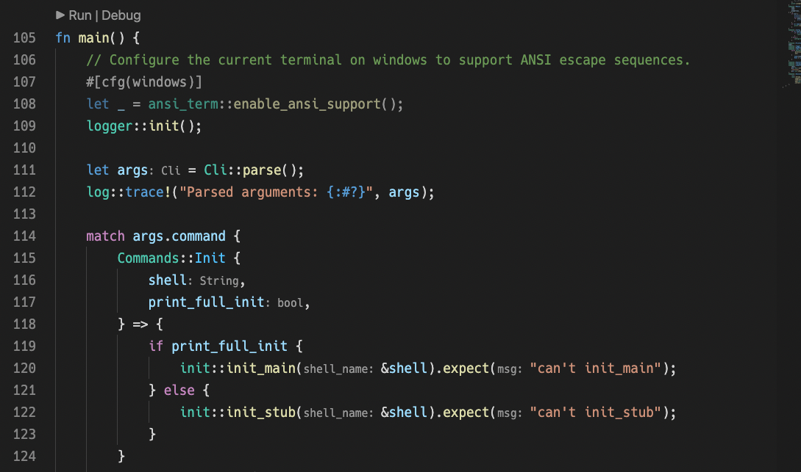
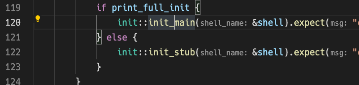

+++
title = "Rustの開発体験が良いことを体感しよう"
date = "2022-02-06T22:28:05+09:00"
draft = false
+++

# Rustの開発体験が良いことを体感しよう

4分くらいなので、 [KOBA789さんの解説動画](https://youtu.be/677kcyyPwJ4) を見ましょう。

- Rust自体のインストール
- VSCode
- rust-analyzer
- clippy

を入れればOKです！

# コードリーディングの仕方

ここではコードリーディングの対象になるような複雑な例として、 [starship/starship](https://github.com/starship/starship) を少し見てみましょう。

```none
git clone https://github.com/starship/starship.git
cd starship
code . # VSCodeを開く
```

rust-analyzerが自動で動いて `target/` ディレクトリが作られていると思います。Rustのエントリーポイントは `src/main.rs` か `src/lib.rs` なので探してみると、 `src/main.rs` が見つかります。



見てみると、薄い灰色文字で `:String` (116行目)、 `:bool` (117行目)と書かれているのが見えます。これはrust-analyzerの機能で、型を自動で表示してくれています。

これによって、関数を呼び出すときにどんな引数をどの型で入れているかが読みやすくなっています。

また、コードジャンプもできるので以下のようにカーソルをジャンプしたい対象に合わせてCtrl+Click(Mac: Cmd+Click)でその定義元にジャンプできます。


このようにして定義をジャンプで見つつ、全体の流れを追っていくことが多いです。

# まとめ

Rustの良さの一つ、開発体験の良さを紹介しました。ぜひ環境構築して、VSCodeの機能やrust-analyzerやclippyなどの開発支援の仕組みを使いこなしていきましょう。

