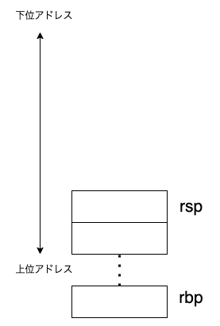
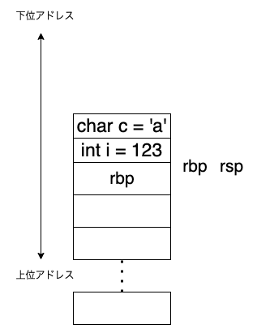
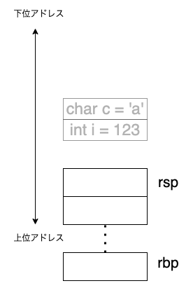
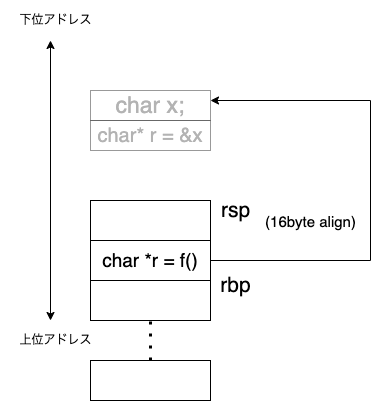
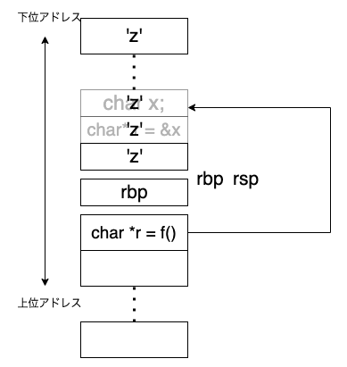

+++
title = "低レイヤに入門して学ぶRustの安全性"
date = "2022-02-06T22:28:05+09:00"
draft = false
+++

# 低レイヤに入門して学ぶRustの安全性

この章では、ダングリングポインタがなぜ危険なのかを学び、Rustのライフタイムという安全のための機構が意味することについて考えます。

Rustの安全性と銘打っていますが、Rustには触れず、主にCとアセンブリの話をします。

[TRPLのライフタイムで参照を検証する](https://doc.rust-jp.rs/book-ja/ch10-03-lifetime-syntax.html) の章で、以下のようなコードが記載されています。

```rust
{
    let r;

    {
        let x = 5;
        r = &x;
    }

    println!("r: {}", r);
}
```

このコードはコンパイルできません。なぜなら、`x`のライフタイムは宣言された `let x = 5;` から始まり、スコープを抜けるまでの間なので、`r`、つまり`x`の参照がスコープ外で無効だからです。

なぜライフタイムを通じてスコープ外の変数を参照することを禁じているのでしょうか？この詳細をC言語や低レイヤの観点から理解できるようになることが本資料の目的です。

それではまずはC言語で同等の動作をするコードを見ていきましょう。

# C言語でダングリングポインタを作る

まずはダングリングポインタがやばい例を紹介し、その次に解説をしていきます。

それでは、以下のコードをコンパイルして実行してみましょう！

```c
// test1.c
#include <stdio.h>

char *f()
{
  char *r;
  char x;
  scanf("%c", &x);
  r = &x;
  printf("&r in f(): %p\n", r);
  return r;
}

// corrupt stack memory
void corrupt()
{
  char d3[100];
  for (int i = 0; i < 100; i++)
  {
    d3[i] = 'z';
  }
}

int main()
{
  printf("Input char!: ");
  char *r = f();

  corrupt();

  printf("Your char: %c\n", *r);
  printf("&r in main(): %p\n", r);
}

```

コンパイルは以下のコマンドです。x86_64環境で動作を確認しています。

```bash
# 環境
# Linux 5.4.0-100-generic #113-Ubuntu SMP Thu Feb 3 18:43:29 UTC 2022 x86_64 x86_64 x86_64 GNU/Linux
gcc test1.c
```

`a.out`というファイルが生成されていると思います。実行してみましょう。

```bash
$ ./a.out
Input char!: 
```

何か文字を入力してくださいと言われているので一文字入力します。すると以下のように表示されます。

```bash
$ ./a.out 
Input char!: a
&r in f(): 0x7ffceed4de8f
Your char: z
&r in main(): 0x7ffceed4de8f
```

入力した文字は `a` なのに、 `z` ですね！と言われてしまいました。他の文字を入力しても `z` になってしまうことが確認できると思います。
これはおかしいのでプログラムが実際どのように動いているか読んでいきましょう。

## チェックポイント

- なぜ別の文字が返ってくるのでしょうか？C言語でこのような不可解なバグに遭遇した時、あなたはデバッグ手法としてどんなものが思い浮かびますか？挙げてみましょう。
  - [解答例](https://gist.github.com/uta8a/caee36f411fc2e55d65bf4d53a1668c2)
- C言語のソースコードを読んで、分からない箇所を挙げてみましょう
  - [解答例](https://gist.github.com/uta8a/8c453d3f7f3368a3763aeb3c4a7e72b3)

# Cのコードを読む

`f()` と `corrupt()` と `main()` の3つの関数があることがわかるので、まず `main()`から動作を追っていきましょう。

```c
int main()
{
  printf("Input char!: ");
  char *r = f();

  corrupt();

  printf("Your char: %c\n", *r);
  printf("&r in main(): %p\n", r);
}
```

`main()` の動作は、char型のポインタ `r` を`f()`から受け取り、`corrupt()`関数を実行して `r`のdereferenceした値、すなわちcharを出力して `r` 自体の値、すなわちアドレス値を返して終了しています。

ここでポイントなのは、`corrupt()`関数は変数`r`に影響を及ぼしていないように見えるため、`f()`の返り値をそのまま出力しているはずだ、というところです。

実際に `corrupt()` 関数を読んでみると、

```c
// corrupt stack memory
void corrupt()
{
  char d3[100];
  for (int i = 0; i < 100; i++)
  {
    d3[i] = 'z';
  }
}
```

内部で`d3`という配列を生成し代入しているだけなので、`r`に影響はないように見えます。

それでは問題の `f()` を読んでいきます。

```c
char *f()
{
  char *r;
  char x;
  scanf("%c", &x);
  r = &x;
  printf("&r in f(): %p\n", r);
  return r;
}
```

char型のポインタを返しています。
内部では、scanfを用いて変数 `x` へと入力した値を代入し、そのアドレス値をrに渡して`r`を返却しています。

今一度、冒頭のTRPLのコードを見てみましょう

```rust
{
    let r;

    {
        let x = 5;
        r = &x;
    }

    println!("r: {}", r);
}
```

これも変数`x`のreferenceを`r`に入れています。スコープを抜ける値 `x` に対する参照を、そのスコープ外でも生きるようにしているという点で `f()` とTRPLのコードは同じことをしていると言えます。

CではRustのようにコンパイルで止められることはありません。

以上をまとめると、`f()`で入力された値の参照(アドレス値)を`r`として`main()`で取得し、`main()`で入力された値のアドレスが指し示す先、すなわち入力した値を出力する。となります。

しかし実際の動作は何を入力しても、入力した値とは異なる `z` が帰ってくるだけでした。なぜこのような挙動をするのでしょうか？その理由を解説します。

## チェックポイント

- `f()` と `corrupt()` と `main()` の3つの関数がしていることを説明してみましょう。分からないところがあれば質問してみましょう。
  - [解答例](https://gist.github.com/uta8a/f35a81648e520a8b5e3bfb2230a145df)

# 無効な参照とスタックの様子

入力された文字を出力するプログラムが、なぜか別の値を出力する、という奇妙な現象を説明するには、低レイヤの知識が必要です。

今回はスタックの動きを見て、その後実際に `f()` に対応するアセンブリを読みます。

# スタックと関数

今回は概念の説明のみで、実際に動きを調べるパートはskipします。実際にメモリの動きはgdbなどを用いて把握することが可能です。

プログラムは、実行中にさまざまな値を扱います。その値はどこに保管されているのでしょうか？それは主にメモリ、レジスタに当たります。

スタックは所有権でも出てきました。再掲します。

> 低レイヤ分野のスタック(スタック領域)
> これはメモリ領域の一部です。データ構造のスタックと似た構造をしていて、push/popを行うことができます。ただそれに加えて、スタックに置かれるデータは全て固定サイズである必要があります。これらの特性のおかげでスタックは高速に動作し、動作するプログラムのパフォーマンスも高いものになります。

スタックはメモリ領域の一部です。下のC言語のコードのスタックの流れをみてみましょう。

```c
void sample_fn() {
    int i = 123;
    char c = 'a';
}// step-3

int main() {
    // step-1
    sample_fn(); // step-2
    
}
```

## step-1

関数が実行される前のスタックの様子です。
rspはスタックポインタを指し、スタックのTop, すなわち一番小さいアドレスです。



## step-2

関数が実行されている時のスタックの様子です。

まず、スタックにrbpを積みます(ここでrspも暗黙的にデクリメント、つまり一個下位アドレスの方に動きます)。そしてrbpにrspを代入します。

次にローカル変数を上に積んでいきます。積まれる間。rspとrbpはそのままです。

まずint型の変数 `i` を宣言しているので、int型は32bit, すなわち4byteなのでrbp(先ほどrspを代入したのでrspと同じ)から4byte分だけ下位の方に伸ばしてその領域に123を格納します。

そして、char型の変数 `c` をさらに積みます。1byte分だけ下位の方に伸ばしてその領域に`a`を格納します。



## step-3

関数が実行された後のスタックの様子です。関数が実行された後、スコープを抜ける際の処理になります。

積んであるローカル変数は無視して、rspはスタックに格納されたrbpを指していますから、そのrbpをpopして元の状態に復帰します。

灰色の元の関数 `sample_fn` のローカル変数は残っていることが確実なわけではないですが、そのまま残っていることもあります。(この辺りは呼び出し規約が関わっていそうですが、筆者はまだ詳しく調べきれていません。)



## まとめ

関数のローカル変数は、現在のスタックの下位アドレスの方へと伸びていくことがわかりました。

今回の例に対応するアセンブリは以下の通りです。(godbolt, x86_64 gcc 11.2)

```none
sample_fn:
        push    rbp
        mov     rbp, rsp
        mov     DWORD PTR [rbp-4], 123
        mov     BYTE PTR [rbp-5], 97
        nop
        pop     rbp
        ret
main:
        push    rbp
        mov     rbp, rsp
        mov     eax, 0
        call    sample_fn
        mov     eax, 0
        pop     rbp
        ret
```

アセンブリについては記事 [アセンブリに触れてみよう](https://qiita.com/kaito_tateyama/items/89272098f4b286b64115) を参考に調べていくと良いでしょう。

## チェックポイント

- 以下のコードのスタックの動きを説明してください。
  - [参考 - godbolt](https://godbolt.org/) をツールとして使いましょう
  - gdb, gdb-pedaを調べてみるのも良いでしょう(時間がかかるので余裕のある時に)
  - [解答例](https://gist.github.com/uta8a/5b3a6d55371f2495b9714364b6e5ef3c)

```c
void sample_fn_2() {
    int i = 456;
}
void sample_fn_1() {
    int j = 234;
    sample_fn_2();
}
void main() {
    sample_fn_1();
}
```

# なぜ `z` が出力されるのか？

なぜ `z` が出力されるのか、前提知識は揃ったので調べていきましょう。

まずはmain関数です。

```c
int main()
{
  printf("Input char!: ");
  char *r = f();

  corrupt();

  printf("Your char: %c\n", *r);
  printf("&r in main(): %p\n", r);
}
```

`printf`は今回無視しても大丈夫なので、無視してみます。

以下のようになります。

```c
int main()
{
  char *r = f();

  corrupt();

  // ここでrの値を出力
}
```

関数 `f()` が呼ばれて終了してから、関数`corrupt()`が呼ばれています。`f()`を見てみます。

```c
char *f()
{
  char *r;
  char x;
  scanf("%c", &x);
  r = &x;
  printf("&r in f(): %p\n", r);
  return r;
}
```

charのポインタ`r`は8byte, char型の`x`は1byteです。

関数は最後に`r`を返すので、返した後のスタックの様子は以下の通りです。



`char *r`は無効な値を指しています。

さて、corrupt関数を次に実行するとスタックはどうなるでしょうか？

関数を呼ぶので、rbpを積んで、`z`を配列に格納します。配列は基本的にはスタックに積まれるので、どんどんスタックが下位に伸びていきます。

関数corrupt内のスタックの様子は以下のようになります。



corruptを抜けた後、スタックの`z`が入っていたところがどうなるのかは保証されていませんが、筆者の検証した環境では値が残っていて、`char *r = f()` で指している値が`z`で上書きされてしまったようです。

これでなぜ `z` になってしまったか分かりましたね！

まとめると、関数を抜け無効になった値`x`を指し示している値`r`は、その後さらに関数が呼ばれた時`x`がもともといた場所が上書きされてしまうことがあるため、`r`が指し示す先にどのような値が入るか分からない、ということになります。

アセンブリは以下のようになります。併せて読んでみると良いでしょう。

```none
.LC0:
        .string "%c"
.LC1:
        .string "&r in f(): %p\n"
f:
        push    rbp
        mov     rbp, rsp
        sub     rsp, 16
        lea     rax, [rbp-9]
        mov     rsi, rax
        mov     edi, OFFSET FLAT:.LC0
        mov     eax, 0
        call    __isoc99_scanf
        lea     rax, [rbp-9]
        mov     QWORD PTR [rbp-8], rax
        mov     rax, QWORD PTR [rbp-8]
        mov     rsi, rax
        mov     edi, OFFSET FLAT:.LC1
        mov     eax, 0
        call    printf
        mov     rax, QWORD PTR [rbp-8]
        leave
        ret
corrupt:
        push    rbp
        mov     rbp, rsp
        mov     DWORD PTR [rbp-4], 0
        jmp     .L4
.L5:
        mov     eax, DWORD PTR [rbp-4]
        cdqe
        mov     BYTE PTR [rbp-112+rax], 122
        add     DWORD PTR [rbp-4], 1
.L4:
        cmp     DWORD PTR [rbp-4], 99
        jle     .L5
        nop
        nop
        pop     rbp
        ret
.LC2:
        .string "Input char!: "
.LC3:
        .string "Your char: %c\n"
.LC4:
        .string "&r in main(): %p\n"
main:
        push    rbp
        mov     rbp, rsp
        sub     rsp, 16
        mov     edi, OFFSET FLAT:.LC2
        mov     eax, 0
        call    printf
        mov     eax, 0
        call    f
        mov     QWORD PTR [rbp-8], rax
        mov     eax, 0
        call    corrupt
        mov     rax, QWORD PTR [rbp-8]
        movzx   eax, BYTE PTR [rax]
        movsx   eax, al
        mov     esi, eax
        mov     edi, OFFSET FLAT:.LC3
        mov     eax, 0
        call    printf
        mov     rax, QWORD PTR [rbp-8]
        mov     rsi, rax
        mov     edi, OFFSET FLAT:.LC4
        mov     eax, 0
        call    printf
        mov     eax, 0
        leave
        ret
```

## チェックポイント

- 仮に`corrupt()`関数がない場合、スタックの様子はどのようになるでしょうか？
  - [解答例](https://gist.github.com/uta8a/1a3af57e64a97a4120e7d08017c84593)

# 無効な値の参照が危険な理由

無効な値の参照は、思った通りのコードの動きをしない(何を入力しても`z`が出力される)ことが分かりました。そしてRustがライフタイムという、変数の寿命管理を通してこれを防いでいることも分かりました。

ここで2つの疑問が生じます。

- 1: 無効な値の参照はどの程度危険なのか？
- 2: Rustのライフタイムは本当に完全に、無効な参照を防ぐことができるのか？

1について、例えば参照先の領域にコードを格納して実行する、という場合を考えてみましょう。仮に入力として `/bin/sh` などのコードを入れれば、参照先の領域のコードを実行した際にシェルが起動します。シェルの上では任意のコードが実行できます。このように、参照先の領域がどうなるか分からないということはたいへん危険なことです。

2については私も詳しく知りません。Rustが主張する安全性がどの範囲でそれがどのように検証、証明されているかという部分はおそらく [RustBelt](https://plv.mpi-sws.org/rustbelt/) で行われていたという認識です。

## チェックポイント

- 任意コード実行可能な場合、どんな悪いことを思いつきますか？またそれを防ぐにはどうしたらよいか、考えてみましょう。
  - [解答例](https://gist.github.com/uta8a/3aeddfaf534875c07f4fb93acd1caaaf)

# まとめ

Rustのライフタイムで登場するダングリングポインタについて、スタック上に限定してC言語で同等のコードを実行し危険性を理解した。

# 補足1: ローカル変数の参照を返却するとセグフォで落ちる

結論からいくと以下のコードはSegmentation faultになります。

```c
#include <stdio.h>

char *f()
{
  char r;
  scanf("%c", &r);
  printf("&r in f(): %p\n", &r);
  return &r;
} // segfault

// corrupt stack memory
void corrupt()
{
  char d3[100];
  for (int i = 0; i < 100; i++)
  {
    d3[i] = 'z';
  }
}

int main()
{
  char *r = f();

  corrupt();

  printf("Input char: %c\n", *r);
  printf("&r in main(): %p\n", r);
}

```

違いは関数`f()`でcharのポインタに代入せずそのまま返却しただけです。コンパイル時にwarningは出ますがコンパイルは通ります。

答えは [ローカル変数アドレス返却とgccの挙動](https://yohhoy.hatenadiary.jp/entry/20160509/p1) にあります。未定義動作なのですが、gccではどうも `mov eax, 0` になるのでSegmentation faultしてしまうようです。

# 補足2: アドレスではなく値をそのまま返したら？

値をそのまま返したらどうなるでしょうか。以下、参照を返さずに値を返すコードです。

```c
#include <stdio.h>

char f()
{
  char r;
  char x;
  scanf("%c", &x);
  r = x;
  printf("&r in f(): %p\n", &r);
  return r;
}

// corrupt stack memory
void corrupt()
{
  char d3[100];
  for (int i = 0; i < 100; i++)
  {
    d3[i] = 'z';
  }
}

int main()
{
  char r = f();

  corrupt();

  printf("Input char: %c\n", r);
  printf("&r in main(): %p\n", &r);
}

```

このコードは普通に動作します。アセンブリをみると、値がそのままmain関数の変数rに入っているので、スタックが上書きされても影響しません。

# 補足3: アセンブリとポインタが分かりません！
- [C言語のポインタとアドレスをアセンブリコードを用いて理解してみる](https://task4233.hatenablog.com/entry/2019/12/18/115359) が参考になります。

# 残された疑問(筆者の疑問)
- ダングリングポインタってIPAだとheapの解放済み部分を指していると思うんだけど、TRPLではスタックに積んだ値がスコープを抜けた後を指している。スタックの場合もスコープ抜けたらダングリングと呼ぶのか？
- RustBeltって終わったんですか？endedって書かれてる...
