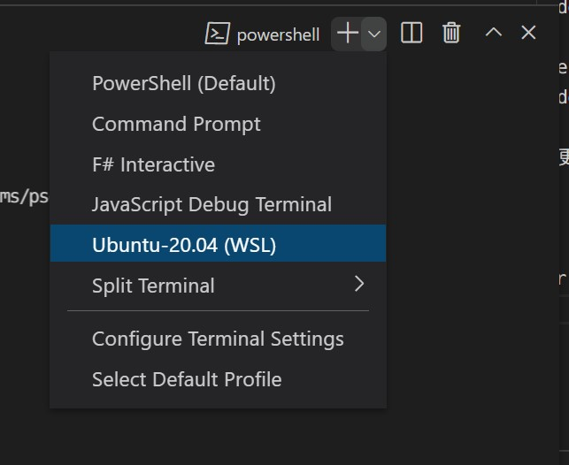

+++
title = "WSL2の導入"
date = "2022-02-25T09:07:27+09:00"
draft = false
+++

# 開発環境のためにWSL2を導入

WSLの導入をします。これはWindowsの方が対象です。Mac/Linuxの方は次の章に進んでください。

## 手順

- まず、OSについて説明します。OSはパソコン(ハードウェア)の機能を使い様々なことを実現している縁の下の力持ちのようなソフトウェアです。Windows, Android, MacOS, LinuxのようにたくさんのOSがあります。その中でWindowsで開発を行うことは初心者には難易度が高く、Linuxで開発を行う方が簡単なように私は感じたので、今回はWindowsの上でLinuxを動かして、その上で開発を行います。
- つまり、開発環境としてWSL2を使います。
- [https://docs.microsoft.com/ja-jp/windows/wsl/install](https://docs.microsoft.com/ja-jp/windows/wsl/install) を参考にWSLを導入してください。usernameはスペースを使わないで、短いものにすると良いと思います。例えば私のユーザ名は`uta8a`です。
- なにか困ったことがあればdiscordで質問してください。
- できたらVSCodeでフォルダを開いて、ターミナルを開いてください。そこにコマンドを打ちます。このときターミナルではUbuntuを選択してください。



```none
sudo apt update
sudo apt upgrade
```

とパッケージの更新をして、

```none
uname -a
```

と打ってEnterを押してみてください。画面に`Linux...`から始まる文字列が表示されたらOKです。この`uname`コマンドはOSの種類を確認するコマンドです。

#### feedback

フィードバックのリンクは [こちら](https://forms.gle/Yd7nN2FK5tTYP6Xp8)
