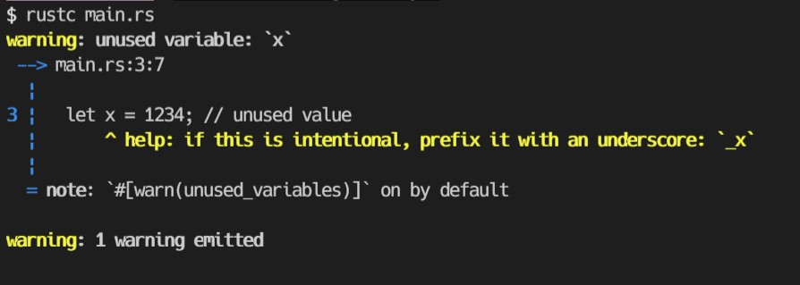
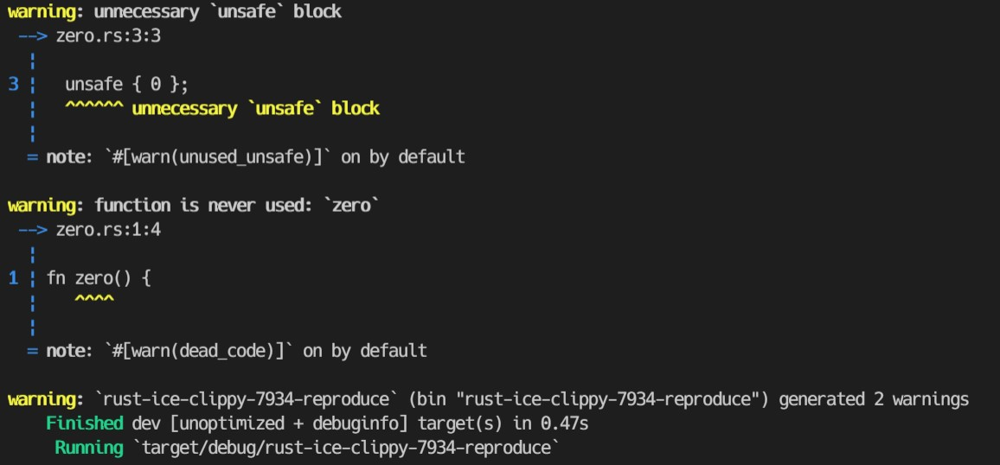

# IssueとPRを読む

## Issue [#7826](https://github.com/rust-lang/rust-clippy/issues/7826)

> will machine readable format be added? or is there already one?

質問タイプ。エラーメッセージやlinterの出力を人間フレンドリーでなく機械フレンドリーなものはありますか？という疑問。

回答として、[rustc book / JSON output](https://doc.rust-lang.org/rustc/json.html)があげられているので読んでみる。

rustcによって出力されるJSON。これは `--error-format=json` flagをつけることで出てくる。

**実際に unused variable でJSON形式でエラーを出してみた。**

挙動

- 正常にコンパイルされエラーが出ないならばJSONも出力されない(空の`{}`すら出てこない)
- メッセージが出るならば、メッセージひと単位あたりひとつのJSONが出力される。区切り文字は改行のようだった。このメッセージは [cargo_metadata](https://github.com/oli-obk/cargo_metadata) を用いてパースしたりできるらしい。

```rust:main.rs
fn main() {
  println!("HELLO: {}", 123);
  let x = 1234; // unused value
}
```

```json:message-1
{"message":"unused variable: `x`","code":{"code":"unused_variables","explanation":null},"level":"warning","spans":[{"file_name":"main.rs","byte_start":48,"byte_end":49,"line_start":3,"line_end":3,"column_start":7,"column_end":8,"is_primary":true,"text":[{"text":"  let x = 1234; // unused value","highlight_start":7,"highlight_end":8}],"label":null,"suggested_replacement":null,"suggestion_applicability":null,"expansion":null}],"children":[{"message":"`#[warn(unused_variables)]` on by default","code":null,"level":"note","spans":[],"children":[],"rendered":null},{"message":"if this is intentional, prefix it with an underscore","code":null,"level":"help","spans":[{"file_name":"main.rs","byte_start":48,"byte_end":49,"line_start":3,"line_end":3,"column_start":7,"column_end":8,"is_primary":true,"text":[{"text":"  let x = 1234; // unused value","highlight_start":7,"highlight_end":8}],"label":null,"suggested_replacement":"_x","suggestion_applicability":"MachineApplicable","expansion":null}],"children":[],"rendered":null}],"rendered":"warning: unused variable: `x`\n --> main.rs:3:7\n  |\n3 |   let x = 1234; // unused value\n  |       ^ help: if this is intentional, prefix it with an underscore: `_x`\n  |\n  = note: `#[warn(unused_variables)]` on by default\n\n"}
```

```json:message-2
{"message":"1 warning emitted","code":null,"level":"warning","spans":[],"children":[],"rendered":"warning: 1 warning emitted\n\n"}
```



## Issue [#7934](https://github.com/rust-lang/rust-clippy/issues/7934)

> ICE with `clippy::undocumented_unsafe_blocks`

[portable-simd](https://github.com/rust-lang/portable-simd)でICE(Internal Compile Error)が起きる。

これrustcの問題では？と思ったが、報告されているエラーメッセージには以下のようにclippyに報告するように書いてある。

```
error: internal compiler error: unexpected panic

note: the compiler unexpectedly panicked. this is a bug.

note: we would appreciate a bug report: https://github.com/rust-lang/rust-clippy/issues/new
```

MCVE(Minimal Complete and Verifiable Example ようは条件を満たす最小単位のこと、この場合だとICEになる最小再現コード)が提示されている。試してみる。

stableでは再現しなかった。nightlyを入れて `rustup run nightly cargo run` してもこのバージョンより新しいから(おそらく修正済みになっており)再現しなかった。



関連して PR [#7945](https://github.com/rust-lang/rust-clippy/pull/7945) を読む。

## PR [#7945](https://github.com/rust-lang/rust-clippy/pull/7945)

> Fix ICE in undocumented_unsafe_blocks

Issue [#7934](https://github.com/rust-lang/rust-clippy/issues/7934) の解決PR。

MCVEはテストに利用されるみたい。clippyでは `tests/ui/crashes` にICEが置かれるのかな。 auxiliary というディレクトリがある。auxiliaryは意味的に補助ということらしい？uiはどういう意味なんだろう。おそらく、複数ファイルによるtestは補助ディレクトリに`main.rs`以外を置いて`tests/ui/crashes`以下に`main.rs`を`ice-<number>`の形で置いているみたい？

UIテストについては [rustc-dev-guide/Guide to the UI tests](https://rustc-dev-guide.rust-lang.org/tests/adding.html#ui)に記述がある。UIの名前が意味するところは分からなかった。

[rust-clippyのclippy_lints/src以下](https://github.com/rust-lang/rust-clippy/tree/master/clippy_lints/src) にruleがめちゃ置いてある。今回はこの中のlintのルールのひとつである `undocumented_unsafe_blocks` が修正されている。このルールは PR [#7748](https://github.com/rust-lang/rust-clippy/pull/7748) で追加されている。このlintは2人が別々に実装し結局こっちが採用された経緯があるみたい。確かにOSSで実装がバッティングしちゃうのはありそう。

## PR [#7748](https://github.com/rust-lang/rust-clippy/pull/7748)

> Add undocumented_unsafe_blocks lint

unsafeブロックでドキュメントコメントが書かれてないなら警告を出すlint ruleの追加PR。


