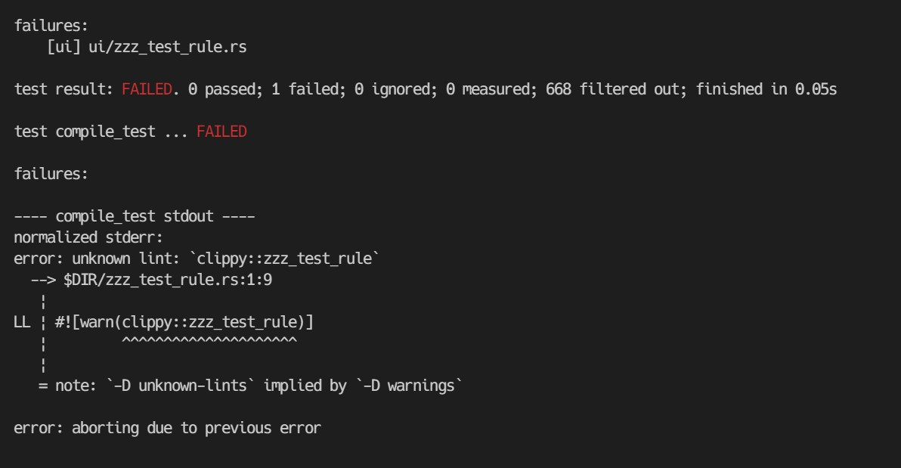

+++
title = "Contributing to Clippy を読む"
date = "2022-02-03T21:50:49+09:00"
draft = false
+++

# [Contributing to Clippy](https://github.com/rust-lang/rust-clippy/blob/master/CONTRIBUTING.md#writing-code) を読む

**読んで分かったこと**

- questionはZulipの #clippy で尋ねてみるのがよさそう。Zulipは[archive](https://zulip-archive.rust-lang.org/)がとられていて、見れるようになっている
- [Rust Code of conduct](https://www.rust-lang.org/policies/code-of-conduct)に従うこと。日本語訳部分読んでみたけど気を配ろうという人間として普通の振る舞いだった。でも文化の違いとかあるだろうし気を配らないと。
- [Basics for hacking on Clippy](https://github.com/rust-lang/rust-clippy/blob/master/doc/basics.md)とかいう初心者向けのドキュメントがあり親切さにビビる。
- [How Clippy works](https://github.com/rust-lang/rust-clippy/blob/master/CONTRIBUTING.md#how-clippy-works)が本丸っぽい。
- [Adding a new lint](https://github.com/rust-lang/rust-clippy/blob/master/doc/adding_lints.md) が今回やろうとしているlinterの追加に一番近い。

**手を動かしてみる**

clippyを `git clone` してくる

[Adding a new lint](https://github.com/rust-lang/rust-clippy/blob/master/doc/adding_lints.md) によるとまずテストを追加するとのことなので、追加して `TESTNAME=zzz_test_rule cargo uitest` を走らせる

上のように、linterそんなのないよというエラーで落ちる。正常に動いている。次に中身を追加と期待されるstderrを追加する。

中身を追加して `TESTNAME=zzz_test_rule cargo uitest` 走らせたらエラー。`declare_clippy_lint!` は `declare_tool_lint` が、`declare_lint_pass!` は `declare_lint_pass` から来ているのでこれらをimportする。

ここでよく分からないので実例を見てみる。行数をtokeiを使って見た。`tokei . --files --sort lines | grep -E '\./[A-Za-z_]+\.rs'`

どうやら [temporary_assignment.rs](https://github.com/rust-lang/rust-clippy/blob/master/clippy_lints/src/temporary_assignment.rs) が短いようなので見に行く。

