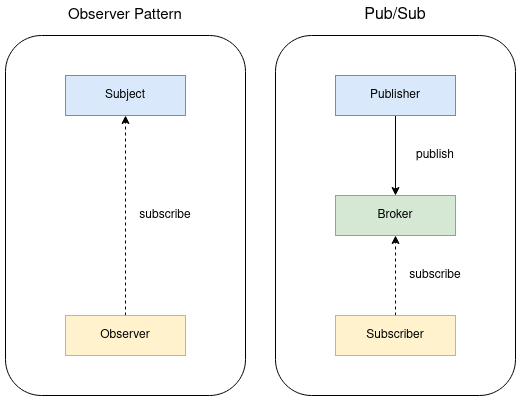

# 雑多なもの

> まとまってきたらページに切り出す

## 方針

> [僕が分からないこと一覧](https://www.notion.so/4abe82f4ac284f70bab64c77e366fbbe?v=ca4280d1fecd4445bfeeded51c696211)から見る

## 通知について

Pub/Sub 方式とは何か？

publish/subscribe を表す。ソフトウェアデザインパターンのひとつで、クラウドや分散システムの文脈で登場する。

以下の 3 つの要素で構成される

- Broker
  - メッセージを仲介する。Publisher から送られたメッセージがプールされていて、そのメッセージをトピックやメッセージの内容でフィルタリングして Subscriber に渡す
- Publisher
  - メッセージを送信する。トピックベースであれば、トピックを指定してメッセージを Broker に渡す。
- Subscriber
  - メッセージを受信する。トピックベースであれば、トピックを指定して Broker からメッセージを受け取る。

実際は PUSH 通知のような多くのユーザに同一のメッセージを送る場面で用いられる。また、[Google Cloud Pub/Sub のユースケース](https://cloud.google.com/pubsub?hl=ja)によると、リアルタイムデータ分析にも用いられているようだ。主なサービスとして、AWS Simple Notification Service(SNS), Google Cloud Pub/Sub がある。(Pub/Sub という名前なのでここで触れたが、実装がどうなっているか分からないので、原義の Pub/Sub 方式かどうかは分からない。)

有名なデザインパターンに Observer パターンというものがある。これとの違いは、Broker に相当する存在があるかないかである。Observer パターンでは送信者と受信者が直接やり取りするが、Pub/Sub では間に Broker が入る。

MQTT について
MQTT は、Message Queueing Telemetry Transport を表す。Pub/Sub 方式で実装された IoT 向けのプロトコル。

todo!

- [Google Cloud Pub/Sub](https://cloud.google.com/pubsub?hl=ja) のチュートリアルをやってみる
- 自分で実装してみる [参考リンク](https://dev.to/mandrewcito/lazy-pub-sub-python-implementation-3fi8)

ref.

- [Pub/Sub メッセージングモデルの業務利用における難しさ](https://qiita.com/TakaakiOtomo/items/badba239ade07c4ea59f) Pub/Sub の定義について
- [出版-購読型モデル - wikipedia](https://ja.wikipedia.org/wiki/%E5%87%BA%E7%89%88-%E8%B3%BC%E8%AA%AD%E5%9E%8B%E3%83%A2%E3%83%87%E3%83%AB)
- [Python における Pub/Sub パターンの実装](https://webty.jp/staffblog/production/post-3328/) 特に Observer と Pub/Sub の違いについてと、実装
